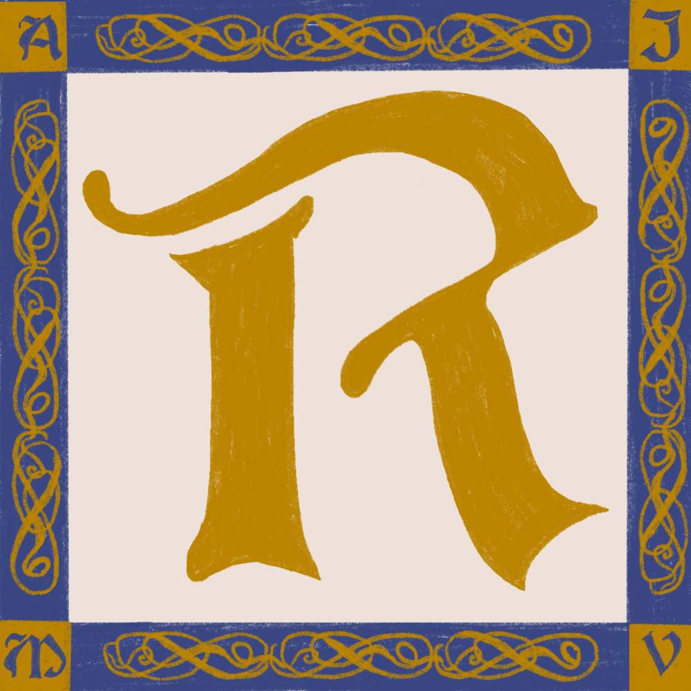

# lmu-cmsi-3802-homework1

  

<h1 align="center">Rímere</h1>

<h2 align="center">
  Computing for the Medieval World!
</h2>

---

## Overview

---

## Features

---

## Checks

### Static

### Safety

### Security

## Example/Comparison Programs
